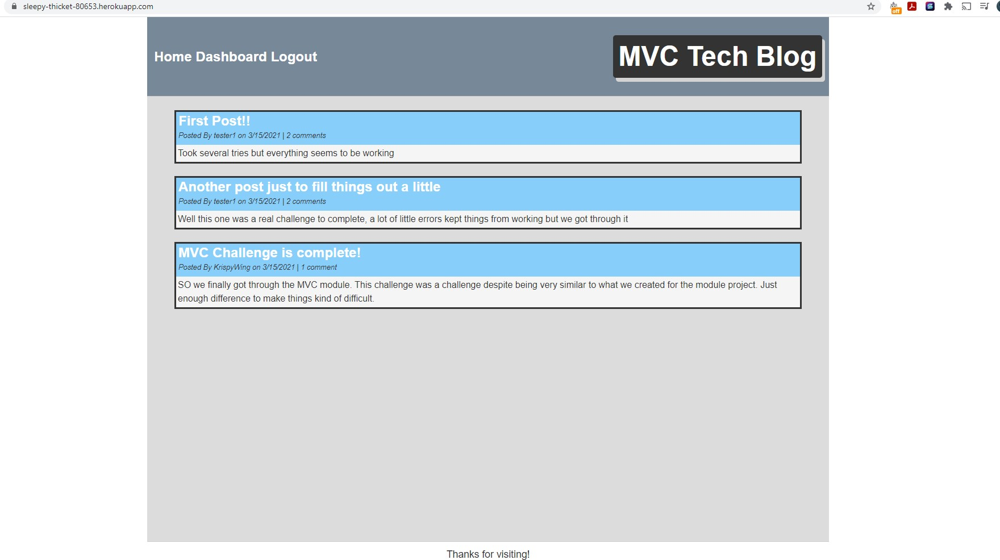
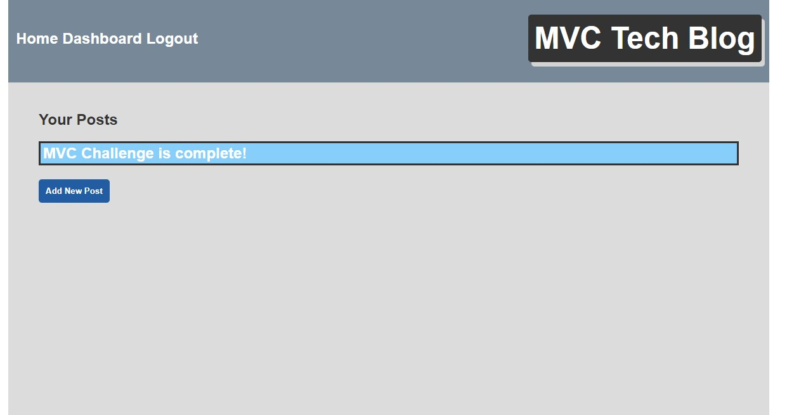
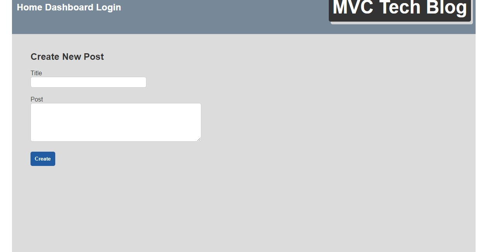
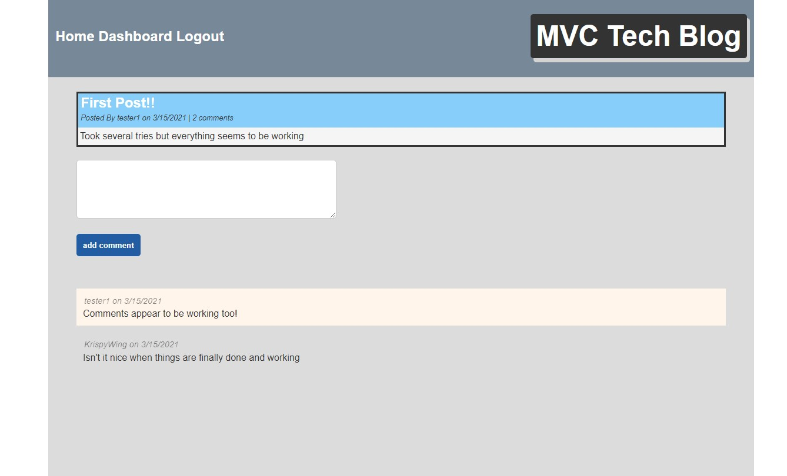

## Title

MVC Tech Blog

## Table of Contents:
  
* [Description](#description)
* [Technologies](#technologies)
* [Preview](#preview)
* [Website-link](#website-link)
* [Installation](#installation)
* [Usage](#usage)
* [Contribution](#contribution)
* [License](#license)
* [Contact](#contact)

## Description

This is a basic CMS-style Tech blog. You are presented with a homepage that shows all the current posts. A nav bar at the top gives you the option of going to the homepage, dashboard or login. 

On the login page you are given the ability to login with your username and password if you already have one or signup a new user. 

Once logged in you will be taken to your dashboard where you can view all of your own posts as well as create a new one. Clicking on an existing post allows you to edit it.

On the homepage clicking on a post title will open it and allow you to comment on it.

The Login option switches to a Logout after sign in, and the page will auto logout after 30 minutes.

## Technologies

 
with the following npm packages
* `express.js` 
* `dotenv`
* `Sequelize`
* `bcrypt`
* `express-handlebars` 
* `express-session`
* `connect-session-sequelize`

## Preview

## Website-link

https://sleepy-thicket-80653.herokuapp.com/ 

## Installation

No installation is needed as the app is deployed on heroku

## Contribution

Boris Veselov

## License
  
MIT license

## Contact

borisveselov@yahoo.com
github.com/boris-veselov

